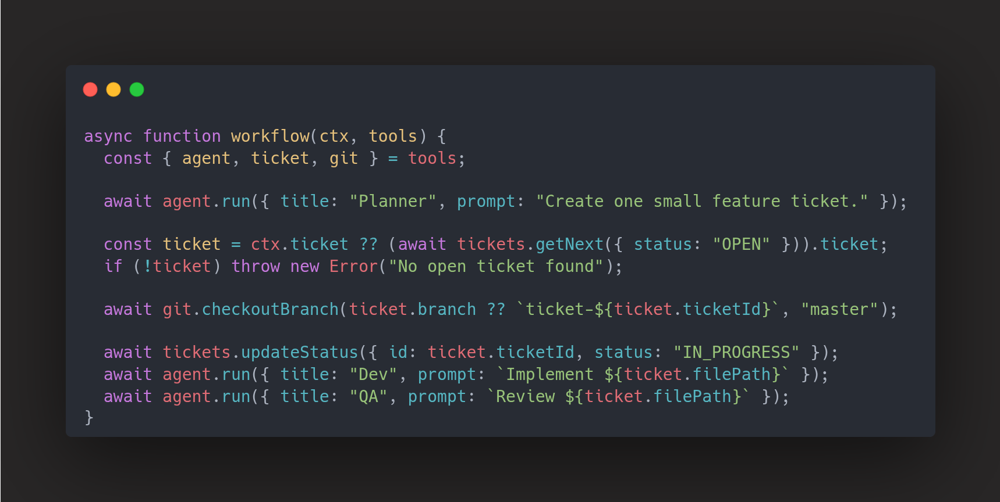

<p align="center">
  
</p>

# ClankerFLow

`clankerflow` is a Rust CLI, drop-in OpenCode framework that allows you to run deterministic AI workflows in your repository using readable Typescript. 
Get the full power of OpenCode with the full power of a programming language. Workflows can be easily containerized for yolo mode or run rawdog on your machine. 

Workflows are authored in TypeScript and executed by a managed Node runtime, while Rust owns orchestration, state, and OpenCode lifecycle calls.

<p>
  
</p>

## Example Workflows
See more example workflows in our example document [here](docs/examples.md)

## What it does

- Initializes a project-local workflow scaffold under `.agents/`.
- Runs workflows on host or in a containment container.
- Persists workflow runs/events in SQLite.
- Integrates with OpenCode sessions from Rust (run/messages/events/cancel/command).
- Opens the OpenCode web UI for the current project when you start a workflow.

## Requirements

- Rust toolchain (edition 2024 compatible).
- Node + npm (used during `clankerflow init` to install runtime dependencies).
- Docker (only if you use containment mode).
- OpenCode local server reachable at `http://127.0.0.1:4096` by default.

## Install and build

```bash
cargo install --git https://github.com/AlextheYounga/clankerflow.git clankerflow
```

After build, the CLI binary is named `clankerflow`.

## Quick start

From the repository you want to automate:

```bash
clankerflow init
```

Then run a workflow:

```bash
# Run the duos.js workflow
clankerflow work duos
```

`clankerflow work` now also opens the OpenCode manage URL in your browser automatically.

## CLI commands

- `clankerflow init` - initialize or refresh `.agents` scaffold.
- `clankerflow work <name>` - run workflow `.agents/workflows/<name>.ts`.
  - `--env host|container`
  - `--yolo`
  - `--containment` (shorthand for container + yolo)
- `clankerflow manage` - open OpenCode sessions UI for current project.
- `clankerflow make ticket` - create a new ticket markdown file.
- `clankerflow make worktree <branch>` - create a git worktree under `.agents/.worktrees/<branch>`.
- `clankerflow containment up|down` - start/stop containment container.

## Containment mode

Containment runs workflows inside a Docker container so agents can operate with full autonomy (`--yolo`) without touching your host filesystem directly.

```bash
# Start the container (idempotent — builds on first run)
clankerflow containment up

# Run a workflow inside the container with safety checks disabled
clankerflow work duos --containment

# Or use the flags separately
clankerflow work duos --env container --yolo

# Stop and remove the container when done
clankerflow containment down
```

Each project gets its own persistent container named `agent-{codebase_id}`, derived from your project path. The container:

- Bind-mounts your project root as `/workspace` (read-write).
- Mounts `~/.config/opencode` read-only so the agent can reach your OpenCode server.
- Rewrites `127.0.0.1` URLs to `host.docker.internal` automatically.
- Ships with git, build-essential, gitleaks, and the OpenCode CLI pre-installed.
- Stays alive between runs (`restart: unless-stopped`) so subsequent workflows start instantly.

The Dockerfile and compose file are scaffolded into `.agents/.clankerflow/docker/` during `init` and can be customized per-project.

Workflows can check their environment at runtime via `ctx.runtimeEnv` and `ctx.yolo`:

```ts
async function careful(ctx, { agent }) {
  await agent.run({
    title: ctx.yolo ? "Cowboy" : "Engineer",
    prompt: ctx.yolo
      ? "You have full autonomy. Ship it."
      : "Proceed carefully and explain each step.",
  });
}
```

## Workflow runtime notes

- Workflow files live at `.agents/workflows/*.ts`.
- Runtime helpers are scaffolded under `.agents/.clankerflow/lib`.
- Rust and Node communicate over structured JSON IPC.
- Run monitoring is done in the OpenCode web UI.

More short examples live in `docs/examples.md`.

## Agent API (workflow side)

Current workflow `agent` tool surface includes:

- `agent.run(...)`
- `agent.command(...)`
- `agent.messages(sessionId)`
- `agent.events(sessionId)`
- `agent.cancel(sessionId)`

Example:

```ts
const started = await agent.run({ prompt: "Draft implementation plan" });

if (started.session_id) {
  await agent.command({
    session_id: started.session_id,
    command: "/review",
  });
}
```

## Development

Run Rust tests:

```bash
cargo test
```

Run runtime tests:

```bash
cd runtime
npm test
```
